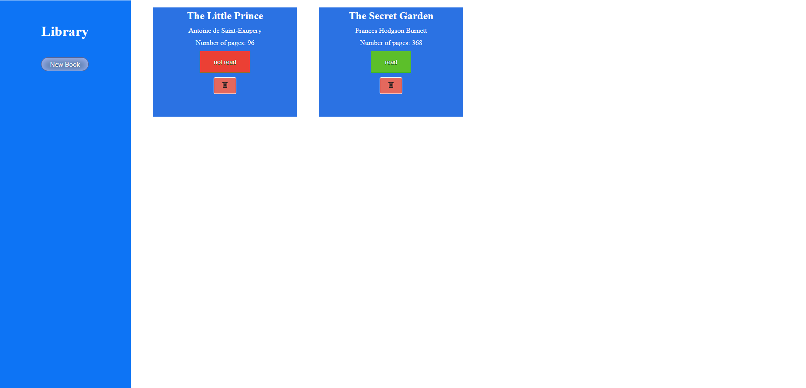

# Library-Odin-Project
This is a mini Library project I made in Odin Project. 

You can use to organize a library for books in your house, each separated on a list. You can remove them, mark if you read or not and more.

## Technologies used in CSS:
 Flexbox and grid. 
 To speed up, I copied the CSS from buttom generator websites.

## Preview
